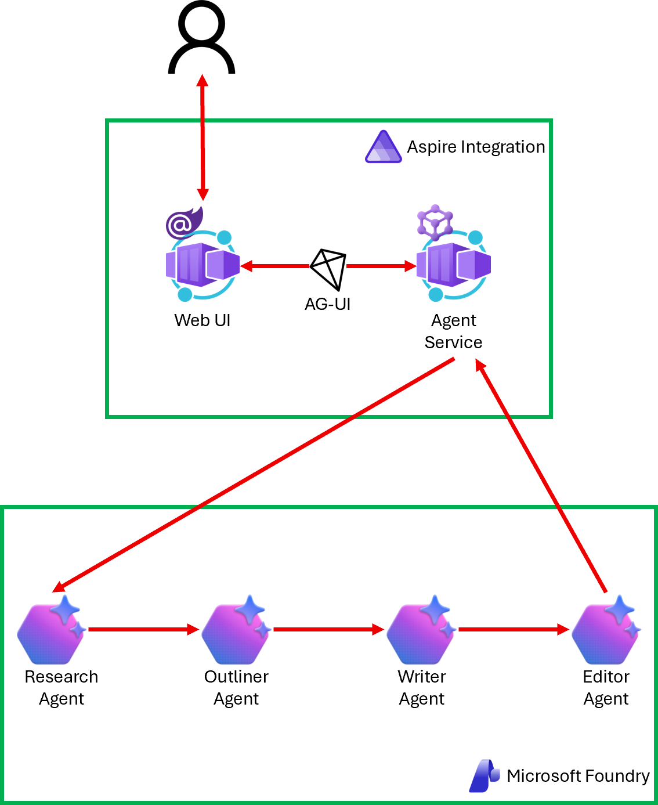
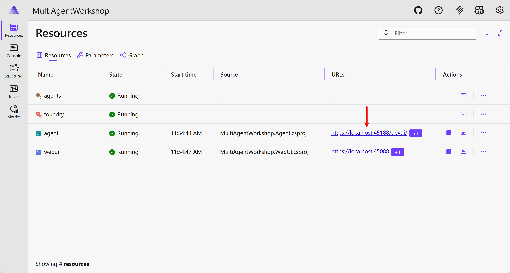
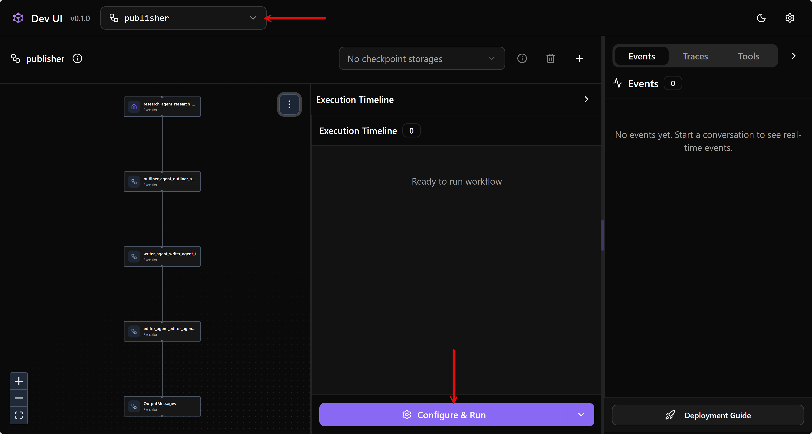
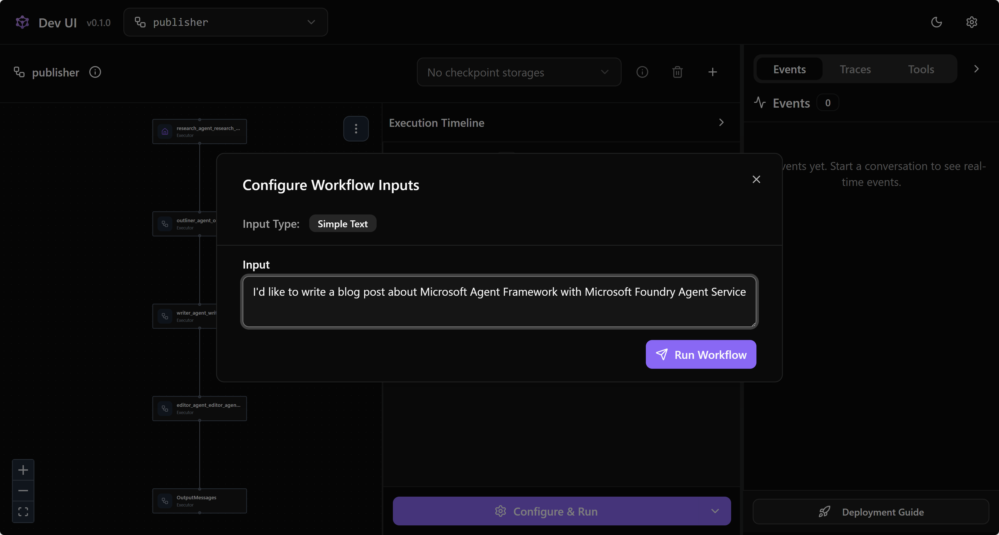
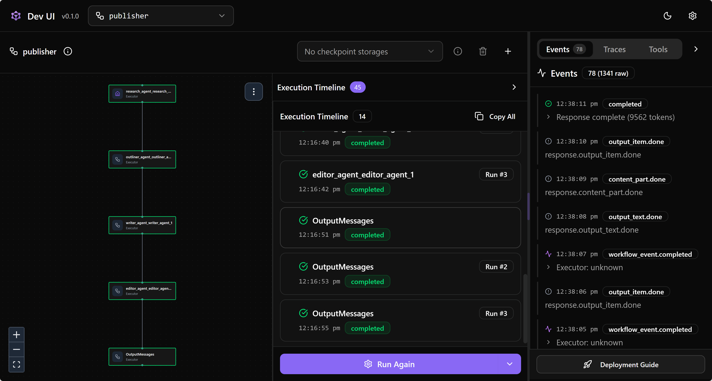
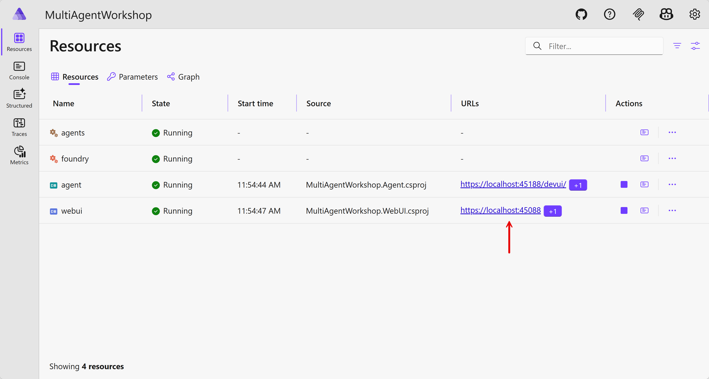
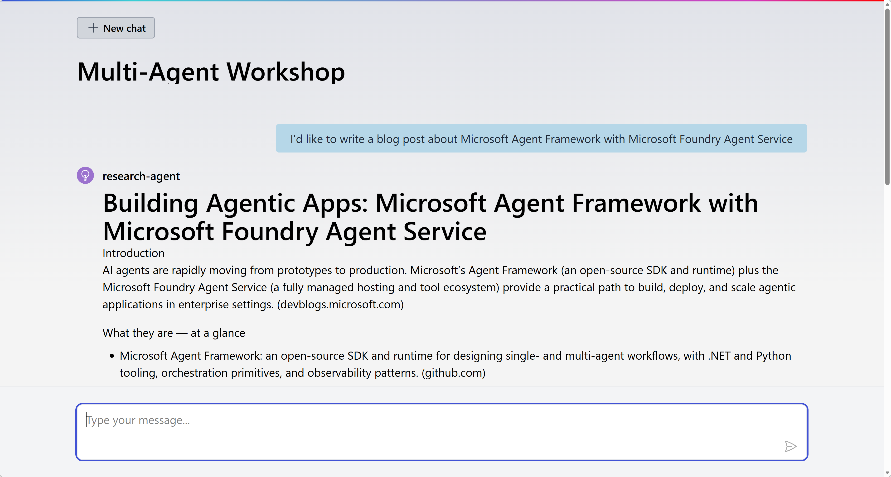

# 01 Sequential Pattern

In a sequential pattern, agents work one after another in a defined pipeline, where each agent's output feeds into the next. This approach works well for tasks that follow a natural progression, like content creation workflows, staged data transformations, or step-by-step analysis.

## Scenario

You're writing a technical blog post with agents &ndash; research agent, outliner agent, writer agent, and editor agent.

<div>
  
</div>

## Get the repository root

1. Get the `$REPOSITORY_ROOT` variable first.

    ```bash
    # zsh/bash
    REPOSITORY_ROOT=$(git rev-parse --show-toplevel)
    ```

    ```powershell
    # PowerShell
    $REPOSITORY_ROOT = git rev-parse --show-toplevel
    ```

## Copy the start project

1. In your terminal, run the following command to copy the start project to the workshop directory.

    ```bash
    # zsh/bash
    mkdir -p $REPOSITORY_ROOT/workshop && \
        cp -a $REPOSITORY_ROOT/samples/01-sequential-pattern/start/. $REPOSITORY_ROOT/workshop/
    ```

    ```powershell
    # PowerShell
    New-Item -Type Directory -Path $REPOSITORY_ROOT/workshop -Force && `
        Copy-Item -Path $REPOSITORY_ROOT/samples/01-sequential-pattern/start/* -Destination $REPOSITORY_ROOT/workshop -Recurse -Force
    ```

## Deploy agents

1. Make sure you're in the `workshop` directory.

    ```bash
    cd $REPOSITORY_ROOT/workshop
    ```

1. Open `src/MultiAgentWorkshop.PromptAgent/appsettings.json`, find the comment line `// Add agents`, and add the `Agents` property underneath it.

    ```jsonc
    {
      ...
      // Add agents
      "Agents": [
        {
          "Name": "research-agent",
          "Version": "1"
        },
        {
          "Name": "outliner-agent",
          "Version": "1"
        },
        {
          "Name": "writer-agent",
          "Version": "1"
        },
        {
          "Name": "editor-agent",
          "Version": "1"
        }
      ]
      ...
    }
    ```

1. Navigate to the `resources-foundry` directory.

    ```bash
    pushd resources-foundry
    ```

1. Run the following command to provision and deploy the agents defined above to Microsoft Foundry.

    ```bash
    azd up
    ```

   While provisioning, you'll be asked to enter an environment name, Azure subscription, and location.

1. Once provisioning and deployment are done, run the following command to confirm that the agents have been deployed successfully.

    ```bash
    # zsh/bash
    az cognitiveservices agent list \
        -a $(azd env get-value FOUNDRY_NAME) \
        -p $(azd env get-value FOUNDRY_PROJECT_NAME) \
        --query "[].id" -o tsv
    ```

    ```bash
    # PowerShell
    az cognitiveservices agent list `
        -a $(azd env get-value FOUNDRY_NAME) `
        -p $(azd env get-value FOUNDRY_PROJECT_NAME) `
        --query "[].id" -o tsv
    ```

   You should see the four agent names.

    ```text
    editor-agent
    writer-agent
    outliner-agent
    research-agent
    ```

1. Navigate back to the workshop directory.

    ```bash
    popd
    ```

## Configure Aspire orchestration

1. Make sure you're in the `workshop` directory.

    ```bash
    cd $REPOSITORY_ROOT/workshop
    ```

1. Verify that all the necessary agent information has been recorded.

    ```bash
    dotnet user-secrets --project ./src/MultiAgentWorkshop.AppHost list
    ```

   You should see the `AZURE_TENANT_ID`, `FOUNDRY_NAME`, `FOUNDRY_PROJECT_NAME`, `FOUNDRY_RESOURCE_GROUP`, and `Foundry:Project:Endpoint` values.

1. Open `src/MultiAgentWorkshop.AppHost/appsettings.json`, find the comment line `// Add agents`, and add the `Agents` property underneath it.

    ```jsonc
    {
      ...
      // Add agents
      "Agents": [
        {
          "Name": "research-agent",
          "Version": "1"
        },
        {
          "Name": "outliner-agent",
          "Version": "1"
        },
        {
          "Name": "writer-agent",
          "Version": "1"
        },
        {
          "Name": "editor-agent",
          "Version": "1"
        }
      ]
      ...
    }
    ```

1. Open `src/MultiAgentWorkshop.AppHost/AppHost.cs`, find the comment `// Add resource for Microsoft Foundry` and add the code right underneath it. This adds the Microsoft Foundry project connection details.

    ```csharp
    // Add resource for Microsoft Foundry
    var foundry = builder.AddFoundry("foundry");
    ```

   > **NOTE**: `.AddFoundry()` is a custom resource that adds the Microsoft Foundry connection details. If you want to know more about the Aspire custom resource, visit [Create custom hosting integrations](https://aspire.dev/integrations/custom-integrations/hosting-integrations/).

1. In the same file, find the comment `// Add resource for agents on Microsoft Foundry` and add the code right underneath it. This exposes the list of agent details to the referencing application.

    ```csharp
    // Add resource for agents on Microsoft Foundry
    var agents = builder.AddAgents("agents");
    ```

   > **NOTE**: `.AddAgents()` is a custom resource that adds the list of agent details. If you want to know more about the Aspire custom resource, visit [Create custom hosting integrations](https://aspire.dev/integrations/custom-integrations/hosting-integrations/).

1. In the same file, find the comment `// Add backend agent service` and add the code right underneath it. This defines the backend agent service that references the `foundry` resource &ndash; all the Microsoft Foundry connection details are passed to the backend agent service app.

    ```csharp
    // Add backend agent service
    var agent = builder.AddProject<MultiAgentWorkshop_Agent>("agent")
                      .WithExternalHttpEndpoints()
                      .WithReference(foundry);
    ```

1. In the same file, find the comment `// Add frontend web UI` and add the code right underneath it. This defines the frontend web UI that references both the `agents` and `agent` resources &ndash; the agent details and backend connection details are both passed to the frontend web UI app.

    ```csharp
    // Add frontend web UI
    var webUI = builder.AddProject<MultiAgentWorkshop_WebUI>("webui")
                      .WithExternalHttpEndpoints()
                      .WithReference(agents)
                      .WithReference(agent)
                      .WaitFor(agent);
    ```

## Implement sequential pattern on backend agent service

1. Make sure you're in the `workshop` directory.

    ```bash
    cd $REPOSITORY_ROOT/workshop
    ```

1. Open `src/MultiAgentWorkshop.Agent/Program.cs`, find the comment `// Create AIProjectClient instance with EntraID authentication` and add the code right underneath it. This connects to the Microsoft Foundry project.

    ```csharp
    // Create AIProjectClient instance with EntraID authentication
    var credential = new DefaultAzureCredential(new DefaultAzureCredentialOptions() { TenantId = config["AZURE_TENANT_ID"] });
    var projectClient = new AIProjectClient(endpoint: new Uri(endpoint), tokenProvider: credential);
    ```

1. In the same file, find the comment `// Register all agents passed from Aspire` and add the code right underneath it. This pulls the agent details from the Microsoft Foundry project and registers them in the IoC container as singleton services.

    ```csharp
    // Register all agents passed from Aspire
    foreach (var agentSettings in agents)
    {
        var agentReference = new AgentReference(agentSettings.Name, agentSettings.Version);

        var agent = projectClient.AsAIAgent(
            agentReference: agentReference,
            clientFactory: inner => new AgentRecordShimChatClient(inner)
        );

        builder.Services.AddKeyedSingleton<AIAgent>(agentSettings.Name, agent);
    }
    ```

   > **NOTE**: You may notice the `AgentRecordShimChatClient` class. It's a temporary workaround for a version mismatch between the Microsoft Agent Framework and the Microsoft Foundry SDK, which will be removed soon.

1. In the same file, find the comment `// Build a sequential workflow pattern with the agents registered` and add the code right underneath it.

    ```csharp
    // Build a sequential workflow pattern with the agents registered
    builder.AddWorkflow("publisher", (sp, key) => AgentWorkflowBuilder.BuildSequential(
        workflowName: key,
        agents: [.. agents.Select(a => sp.GetRequiredKeyedService<AIAgent>(a.Name))]
    )).AddAsAIAgent("publisher");
    ```

   Let's break down the code.

   - `builder.AddWorkflow("publisher, ...).AddAsAIAgent("publisher")`: This adds the multi-agent workflow as another agent instance named `publisher` and registers it as a singleton.
   - `AgentWorkflowBuilder.BuildSequential(...)`: This is the sequential workflow builder that uses the same name, `publisher`. Note that it adds multiple agents from the previously registered services in the order declared by the `agents` array.

1. In the same file, find the comment `// Map AGUI to the publisher workflow agent` and add the code right underneath it. The workflow is exposed as an API endpoint at `ag-ui` so that the frontend web UI can communicate with this backend agent service app.

    ```csharp
    // Map AGUI to the publisher workflow agent
    app.MapAGUI(
        pattern: "ag-ui",
        aiAgent: app.Services.GetRequiredKeyedService<AIAgent>("publisher")
    );
    ```

## Implement sequential pattern on frontend web UI

1. Make sure you're in the `workshop` directory.

    ```bash
    cd $REPOSITORY_ROOT/workshop
    ```

1. Open `src/MultiAgentWorkshop.WebUI/Program.cs`, find the comment `// Register all agents passed from Aspire` and add the code right underneath it. This registers all the agent details so that the web UI knows which agent is responding.

    ```csharp
    // Register all agents passed from Aspire
    builder.Services.AddSingleton(agents);
    ```

1. In the same file, find the comment `// Register the backend agent service as an HTTP client` and add the code right underneath it. Aspire already provides the frontend web UI app with the connection details for the backend agent service.

    ```csharp
    // Register the backend agent service as an HTTP client
    builder.Services.AddHttpClient("agent", client =>
    {
        client.BaseAddress = new Uri("https+http://agent");
    });
    ```

1. In the same file, find the comment `// Register AGUI client` and add the code right underneath it. Using this AGUI client, the frontend web UI app communicates with the backend agent service app via the `ag-ui` endpoint.

    ```csharp
    // Register AGUI client
    builder.Services.AddChatClient(sp => new AGUIChatClient(
        httpClient: sp.GetRequiredService<IHttpClientFactory>().CreateClient("agent"),
        endpoint: "ag-ui")
    );
    ```

## Run Aspire

1. Make sure you're in the `workshop` directory.

    ```bash
    cd $REPOSITORY_ROOT/workshop
    ```

1. Make sure you've already logged in to Azure using both Azure CLI and Azure Developer CLI. If you're unsure, follow [this step](./00-setup.md#log-in-to-azure) again.

1. Run the following command to start all apps through Aspire.

    ```bash
    dotnet watch run --project ./src/MultiAgentWorkshop.AppHost
    ```

1. The Aspire dashboard opens automatically.

   

   Click the backend agent service app.

1. When the Dev UI page opens, change the agent to `publisher` and click the "Configure & Run" button.

   

1. Send any request.

   

   See the result and how the workflow progresses on the left-hand side of the screen.

   

1. Go back to the Aspire dashboard and click the web UI app.

   

1. Send any request.

   

   See the result.

1. Press `Ctrl`+`C` to terminate all running apps.

## Deploy to Azure

1. Make sure you're in the `workshop` directory.

    ```bash
    cd $REPOSITORY_ROOT/workshop
    ```

1. Run the following command to provision and deploy both the frontend web UI and backend agent service apps to Azure.

    ```bash
    azd up
    ```

   While provisioning, you'll be asked to enter an environment name, Azure subscription, and location.

1. Once completed, you'll see the web UI application URL on the terminal screen. Open it in your web browser and send a request.

   

   See the result.

1. Once everything is done, remove all the apps and agents from Azure.

    ```bash
    # Delete both the web UI and agent service apps.
    azd down --purge --force

    # Delete all agents and the Microsoft Foundry resource.
    cd resources-foundry
    azd down --purge --force
    ```

---

Congratulations! 🎉 You've just completed the first multi-agent orchestration scenario - the sequential pattern. Let's move on!

👈 [00: Setup](./00-setup.md) | [02: Concurrent Pattern](./02-concurrent-pattern.md) 👉
